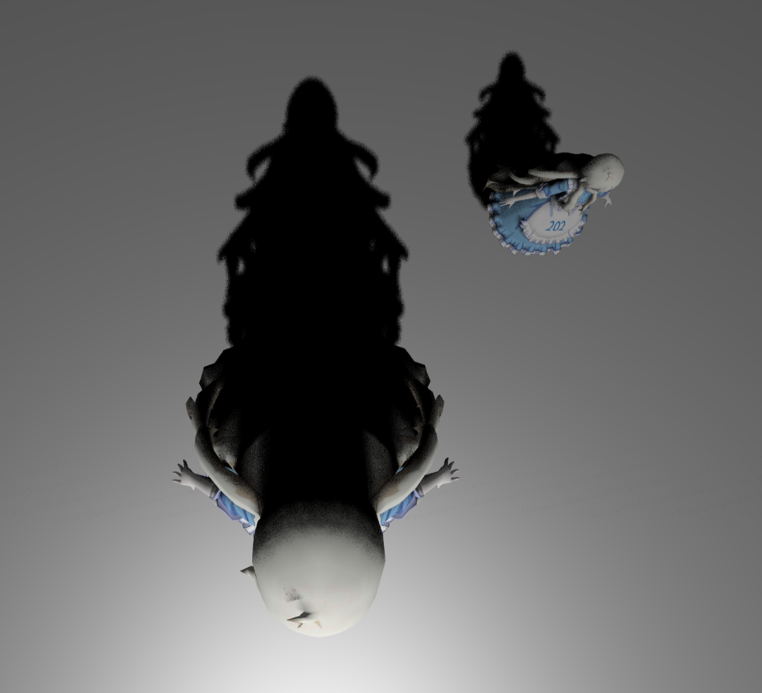

# features
- [x] ShadowMap。见 phongFragment.glsl 的 useShadowMap 函数。

- [x] PCF。见 phongFragment.glsl 的 PCF 函数。

- [x] PCSS。见 phongFragment.glsl 的 findBlocker 和 PCSS 函数。

- [ ] Bonus：多光源 ShadowMap 和动态物体。

# images

> ShadowMap

> PCF

> PCSS