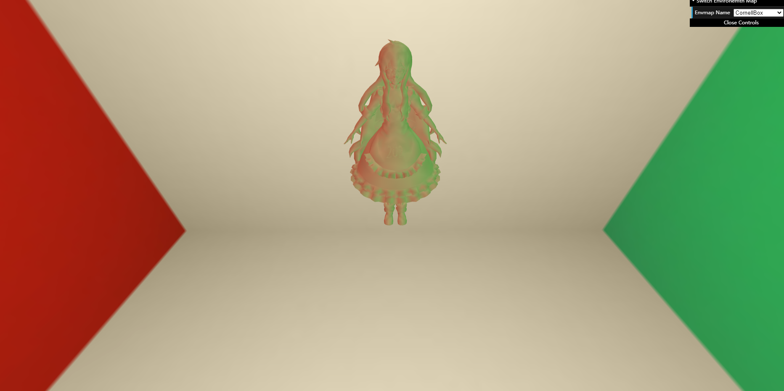
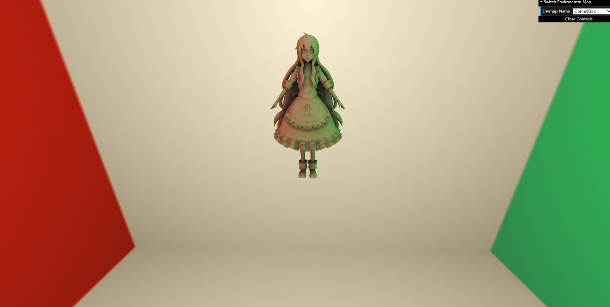
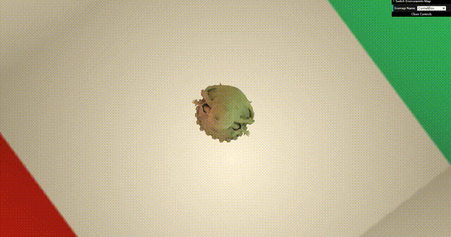

# features
- [x] 预计算环境光照。见 prt.cpp 的 PrecomputeCubemapSH 函数。

- [x] 实现预计算 Diffuse Unshadowed LT。见 prt.cpp 的 preprocess 函数。

- [x] 预计算 Diffuse Shadowed LT。见 prt.cpp 的 preprocess 函数。

- [x] 预计算数据使用。见 PRTMaterial.js prtFragment.glsl prtVertex.glsl。

- [x] Bonus 1: 实现预计算 Diffuse Inter-reflection。见 prt.cpp 的 preprocess 函数。

- [x] Bonus 2: 实现 SH 旋转。见 tools.js。

# images

> Diffuse Unshadowed LT

> Diffuse Shadowed LT

> Diffuse Inter-reflection