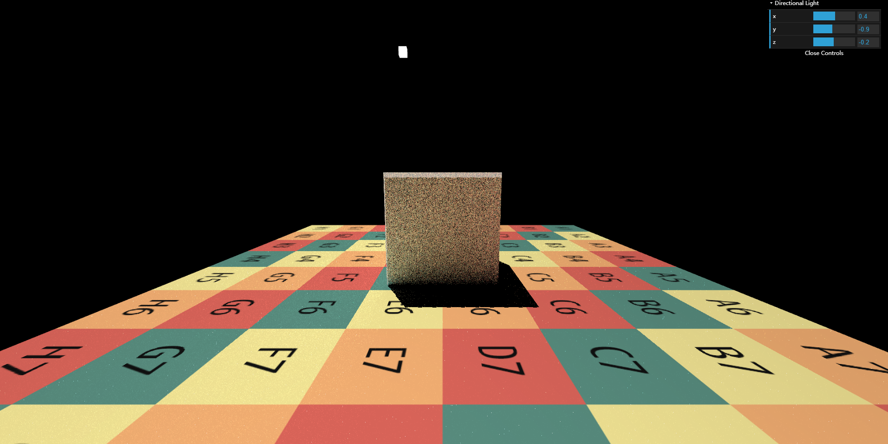
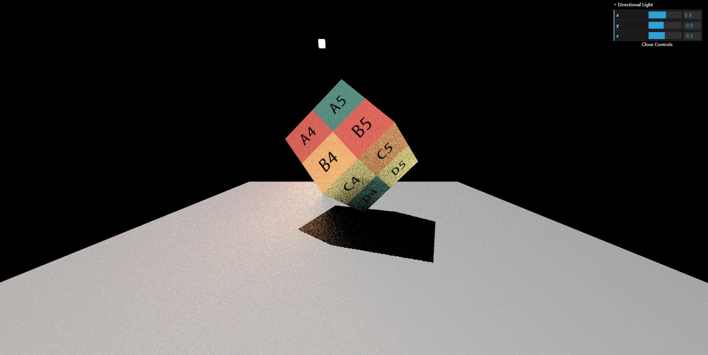
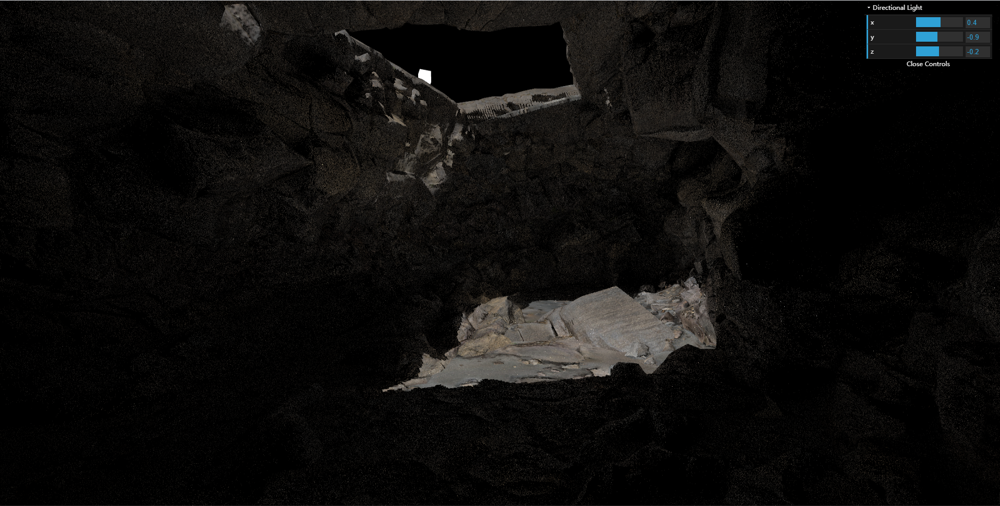

# features
- [x] 实现直接光照。见 ssrFragment.glsl 的 EvalDiffuse 和 EvalDirectionalLight 函数。

- [x] 实现 Screen Space Ray Tracing。见 ssrFragment.glsl 的 RayMarch 函数。

- [x] 实现间接光照。见 ssrFragment.glsl 的 main 函数。

- [ ] Bonus 1：实现 Mipmap 优化的 Screen Space Ray Tracing。

# images

> cube 1

> cube 2

> cave