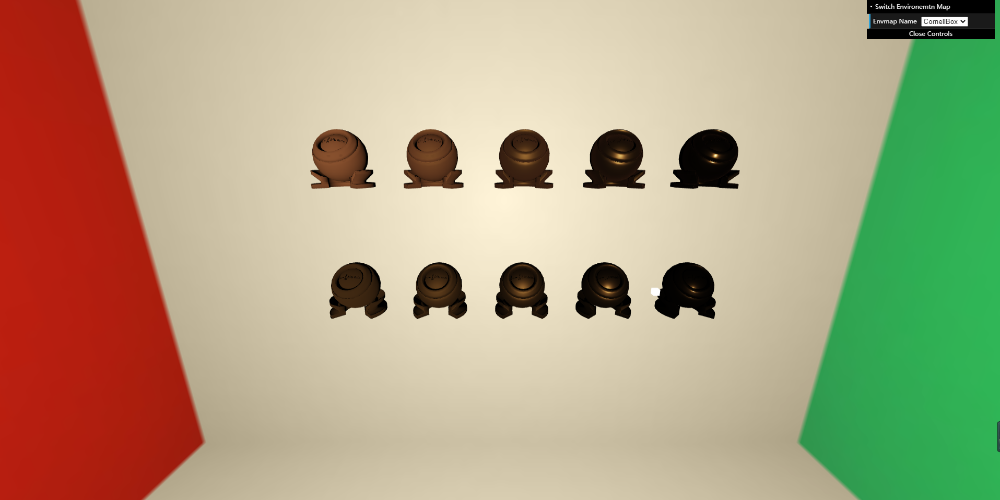

# features
- [x] 实现预计算 E(µ)。见 Emu_MC.cpp 的 IntegrateBRDF 函数。

- [x] 实现预计算 Eavg。见 Eavg_MC.cpp 的 IntegrateEmu 函数。

- [x] 正确实现 PBR 材质。见 PBRFragment.glsl。

- [x] 正确实现 Kulla-Conty 材质。见 KullaContyFragment.glsl。

- [x] Bonus 1：实现重要性采样的预计算方法。见 Emu_IS.cpp 的 IntegrateBRDF 函数。

- [x] Bonus 2：在预计算 E(µ) 时，使用 Split Sum 完成预计算工作。见 Emu_IS.cpp 的 IntegrateBRDF 函数。

# images

