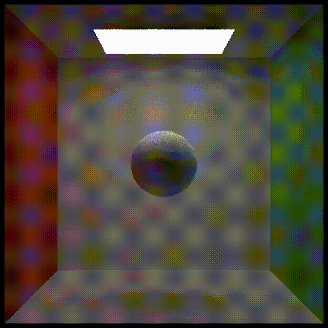
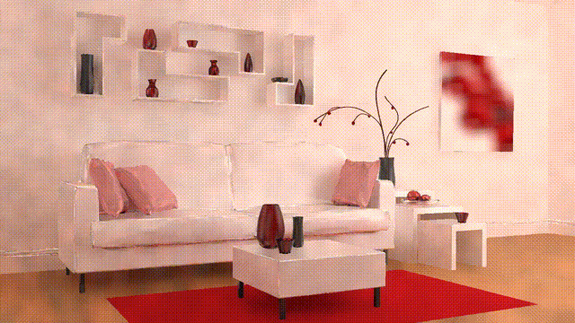

# features
- [x] 实现单帧降噪。参考 denoiser.cpp 的 Filter 函数。

- [x] 实现两帧间的投影。参考 denoiser.cpp 的 Reprojection 函数。

- [x] 实现两帧间的累积。参考 denoiser.cpp 的 TemporalAccumulation 函数。

- [ ] Bonus 1: 实现 À-Trous Wavelet 加速单帧降噪

# results

> box

> pink room
